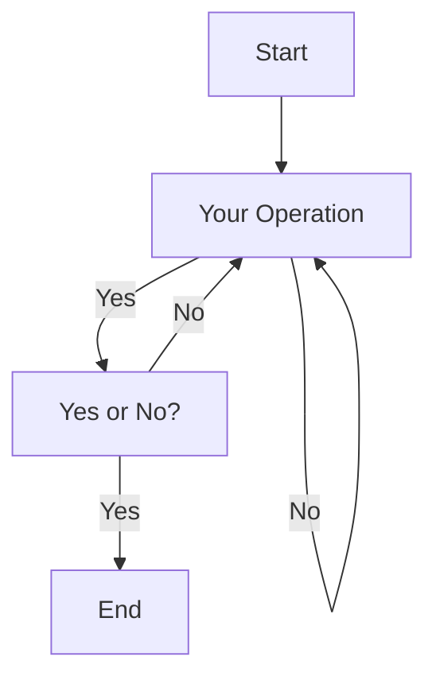

## Markdown的基本语法

#### 1.1 标题

**#号+空格+标题**

可以表示1-6级标题，级数随#数递增。

一级标题字号最大，六级标题字号最小。

代码：

```
# 一级标题
## 二级标题
### 三级标题
#### 四级标题
##### 五级标题
###### 六级标题
```

效果：

# 一级标题
## 二级标题
### 三级标题
#### 四级标题
##### 五级标题
###### 六级标题

> 注意：
 	- 最后一个`#`字符与标题中间留一个空格
 	- 标题应该置于行首，如果放入表格中可能无法解析

#### 1.2 字体

星号与下划线都可以，单是斜体，双是粗体，三是斜粗体

| 代码         | 效果       |
| :---------: | :-------: |
| `*这是斜体*` | *这是斜体* |
| `_这是斜体_` | _这是斜体_ |
| `**这是粗体**` | **这是粗体** |
| `__这是粗体__` | __这是粗体__ |
| `***这是粗斜体***` | ***这是粗斜体*** |
| `___这是粗斜体___` | ___这是粗斜体___ |


> 快捷键：
>
> 	* 加粗 Ctrl + B
> 	* 斜体 Ctrl + I

#### 1.3 换行

Markdown换行的方式有很多种：

	* 直接在一句话后敲两个空格 
	* 两句话之间加一个空行
	* 如果你在编辑的时候，想让一行文字在显示的时候换行，就在中间加`<br/>`
#### 1.4 引用

Markdown 中引用通过符号`>`来实现。`>`符号后的空格，可有可无。

在引用的区块内，允许换行存在，换行并不会终止引用的区块。如果要结束引用，需要一行空白行来结束引用的区块。

代码：

```
>这是一个引用
```

效果：

> 这是一个引用

此外，引用还可以嵌套使用：

代码：

```
>这是一个引用
>>这是一个引用的引用
>>>这是一个引用的引用的引用
```

效果：
>这是一个引用
>>这是一个引用的引用
>>
>>>这是一个引用的引用的引用

#### 1.5 链接

Markdown中插入链接的使用方式是：

代码：

```
[链接名称](链接地址)
<链接地址>
即是：
[这是阡陌的主页](https://space.bilibili.com/184756184)
或者
<https://space.bilibili.com/184756184>
```

效果：

> [这是阡陌的主页](https://space.bilibili.com/184756184)<https://space.bilibili.com/184756184>
>
> <https://space.bilibili.com/184756184>

#### 1.6 图片

Markdown中插入图片的使用方法是：

代码：

```

比如我主页的图片：

```

效果：


> Typora中提供了一种更简便的图片插入方式：
>
> Ctrl+V粘贴图片

#### 1.7 列表

列表分为有序列表和无序列表

* 无序列表，使用`*`、`+`、`-`，再加一个空格作为列表的标记

* 有序列表，使用数字加上`.`号，再加一个空格作为列表的标记

代码：

```
* 无序列表 1
+ 无序列表 2
- 无序列表 3

1. 有序列表 1
2. 有序列表 2
3. 有序列表 3
```

效果：

> * 无序列表 1
> + 无序列表 2
> - 无序列表 3
>
> 1. 有序列表 1
> 2. 有序列表 2
> 3. 有序列表 3

如果想控制列表的层级，则需要在列表符号前使用`Tab`

代码：

```
+ 无序列表 1
+ 无序列表 2
	+ 无序列表 2.1
	+ 无序列表 2.2
	
1. 有序列表 1
2. 有序列表 2
	2.1 有序列表 2.1
	2.2 有序列表 2.2
```

效果：

+ 无序列表 1
+ 无序列表 2
	+ 无序列表 2.1
	+ 无序列表 2.2
	
1. 有序列表 1
2. 有序列表 2
	2.1 有序列表 2.1
	2.2 有序列表 2.2

#### 1.8 分割线

Markdown中给出了多种分割线的样式，我们可以使用分割线让文章结构更加的清晰。

分割线的使用，可以在一行中用三个`-`or`*`来建立一个分割线，但是注意：在分割线的上面空一行！！！

代码：

```
分割线：

---
***
- - -
* * *
```

效果：

> ---
> ***
> - - -
> * * *
> 注意：写分割线前，要空一行再写，否则会导致前一行字体放大。

#### 1.9 删除线

删除线的使用，可以在要添加删除线的文字前后添加`~~`。

代码：

```
~~这是要被删除的文字~~
```

效果：

> ~~这是要被删除的文字~~

#### 1.10 下划线

下划线的使用和HTML中类似，在需要添加下划线的文字首尾添加`<u>文本</u>`

代码：

```
<u>这是添加下划线的文字</u>
```

效果：

><u>这是添加下划线的文字</u>

#### 1.11 代码块

Markdown中的代码块有两种：

如果在一行内需要引用代码，只需用反引号`` `引起来就好了。

代码：

```
`Hello` World.
```

效果：

> `Hello` World.

如果是在一个块内需要引用代码，则在需要引用的代码块的前一行和后一行使用三个反引号，同时前一个反引号后写入代码的语言。

代码：


效果：

```cpp
#include<iostream> 
int main()
{ 
  printf("HelloWorld"); 
}
```

支持以下语言：

```
bash
c，clojure，cpp，cs，css
dart，dockerfile, diff
erlang
go，gradle，groovy
haskell
java，javascript，json，julia
kotlin
lisp，lua
makefile，markdown，matlab
objectivec
perl，php，python
r，ruby，rust
scala，shell，sql，swift
tex，typescript
verilog，vhdl
xml
yaml
```

#### 1.12 表格

表格使用`|`来分割不同的单元格，使用`-`来分割表头和其他行

* `:-`：将表头及单元格内容左对齐
* `-:`：将表头及单元格内容右对齐
* `:-:`：将表头及单元格内容居中

代码：
```
| 项目   | 价格  | 数量 |
| :------ | -----: | :----: |
| 计算机 | \$1600 | 5    |
| 手机   | \$12   | 12   |
| 管线   | \$1    | 234  |
```

效果：

| 项目   |   价格 | 数量 |
| :----- | -----: | :--: |
| 计算机 | \$1600 |  5   |
| 手机   |   \$12 |  12  |
| 管线   |    \$1 | 234  |

#### 1.13 脚注

脚注是对文本的备注，我们时长在论文中看到脚注，在Markdown中的使用方法

代码：

```
使用 Markdown[^1]可以效率的书写文档，直接转换成HTML[^2]，你可以使用 typora[^T] 编辑器进行书写。
[^1]:Markdown是一种纯文本标记语言
[^2]:HyperText Markup Language 超文本标记语言
[^T]:NEW WAY TO READ & WRITE MARKDOWN.
```

效果：

使用 Markdown[^1]可以效率的书写文档，直接转换成HTML[^2]，你可以使用 typora[^T] 编辑器进行书写。

> 注意：
>
> 脚注自动被搬运到最后面，请到文章末尾查看，并且脚注后方的链接可以直接跳转回到脚注的地方。

#### 1.14 特殊符号

对于Markdown中的语法符号，前面加反斜线`\`即可显示符号本身。

代码：

```
\\
\*
\_
\+
\.
等等
```

效果：

> \\
> \*
> \_
> \+
> \.

## Markdown的高级用法

#### 2.1 制作待办事项

我们可以使用`Markdown`来制作一个代办事项，格式为`- [ ]`表示未完成；`- [x]`表示已完成。

代码：

```
- [ ] 高数期末复习
- [x] Markdown学习
- [x] 校内赛
- [x] 装甲板识别
```

效果：

> - [ ] 高数期末复习
> - [x] Markdown学习
> - [x] 校内赛
> - [x] 装甲板识别

> 注意：
>
> `- [ ]` 中`-`与`[`中存在空格，`[`与`]`中存在空格。

#### 2.2 书写公式

Markdown支持书写公式，例如书写一个质能守恒公式。

在整行公式前后添加`$$`，以表示整行公式。

代码：

```
$$
E=mc^2
$$
```

效果：

> $$
> E=mc^2
> $$

#### 2.3 绘制流程图

代码：


效果：



#### 2.4 HTML

Markdown支持原生`HTML`语法，譬如，你可以用HTML写一个纵跨两行的表格：

代码：

```html
<table>
    <tr>
        <th rowspan="2">值班人员</th>
        <th>星期一</th>
        <th>星期二</th>
        <th>星期三</th>
    </tr>
    <tr>
        <td>李强</td>
        <td>张明</td>
        <td>王平</td>
    </tr>
</table>

```

效果：

<table>
    <tr>
        <th rowspan="2">值班人员</th>
        <th>星期一</th>
        <th>星期二</th>
        <th>星期三</th>
    </tr>
    <tr>
        <td>李强</td>
        <td>张明</td>
        <td>王平</td>
    </tr>
</table>

也可以实现对字体格式的改变：

代码：

```html
<font face="楷体" color=#00ffff size=5>改变文字格式</font>
```

效果：

> <font face="楷体" color=#00ffff size=5>改变文字格式</font>

#### 2.5 其他高级用法

见文章:

> [菜鸟教程 Markdown高级技巧](https://www.runoob.com/markdown/md-advance.html)

## Markdown工具

+ 本地APP：Typora
+ 国内博客平台：CSDN、简书、知乎、掘金、博客园等。

## 总结

边学习，边记笔记，方便复习。

​                                                                                                                           2023.12.11

[^1]:Markdown是一种纯文本标记语言
[^2]:HyperText Markup Language 超文本标记语言
[^T]:NEW WAY TO READ & WRITE MARKDOWN.

