# TUP周报

## 2023.12.9

* **上周计划：**

1. ROS 相机 + imu联合标定（已完成） 
2. 校内赛绿色弹丸识别（已完成）  

* **遇到的问题： **

1. 弹丸识别要求五个场景下使用同一 参数进行识别任务，多场景共用一套 预处理识别效果差
2. 相机 + imu联合标定时编译aslam_cv, sm_common等时出错  

* **下周计划： **

1. 学习感知机编写 
2. 学习Markdown编写

## 2023.12.16

* **上周计划：**

1. 学习Markdown编写（已完成，尝试编写了一个.md格式的Markdown语法总结方便回顾）

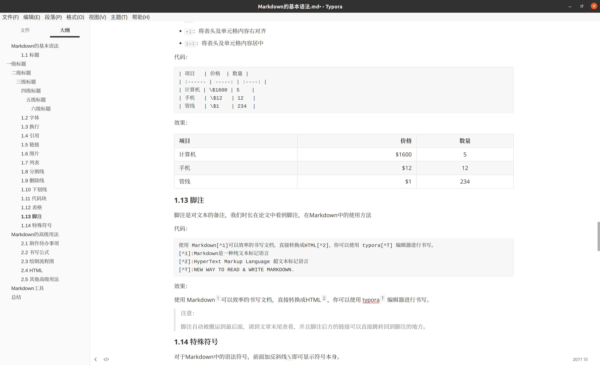

2. 学习感知机编写（已完成简单感知机的编写，尝试用Markdown写了个笔记）

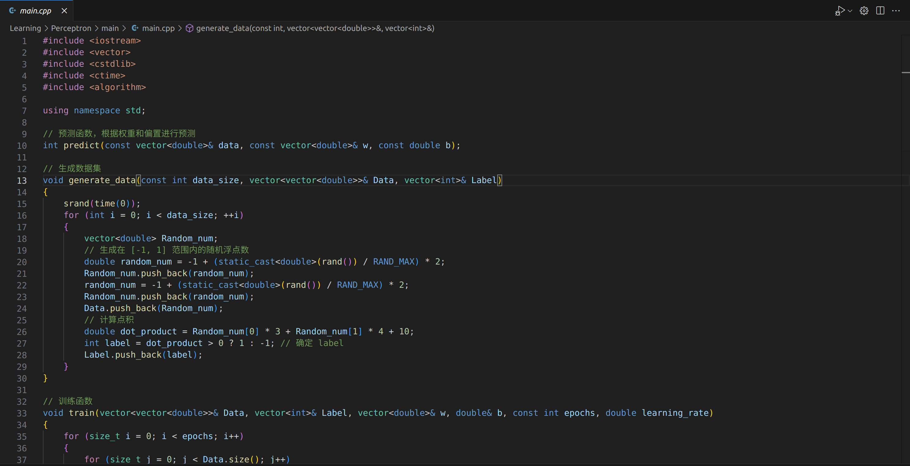

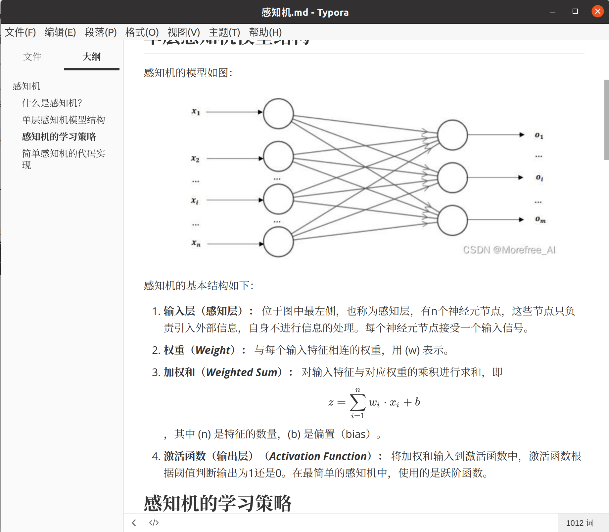

* **遇到的问题：**

在学习感知机时，损失函数（极大似然估计法和交叉熵）和反向传播随机梯度下降法时高数和线代等数学基础知识不够...

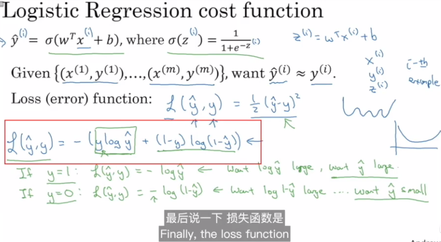

导致感知机不能使用sigmoid函数（涉及到需要使用交叉熵计算的损失函数）

***在补完数学后***，写一个更复杂的感知机。

* **下周计划：**

1. 学习多线程（生产消费者模型）
2. 初步学习ROS

## 2024.2.21

* **本周完成：**

1. 继续学习ROS2   学习编写tf2广播 

2. 配置大符环境 读大符代码 
3. 深入学习C++   学习class

* **遇到的问题：**

 暂无

* **下周计划：**

1. 继续学习ROS2 

2. 深入学习C++

## 2024.2.25

* **本周完成：**

1. 继续学习ROS2 学习编写tf2广播器（broadcaster）和监听器（listener）实现小乌龟跟随demo 
2. 继续学习C++ class

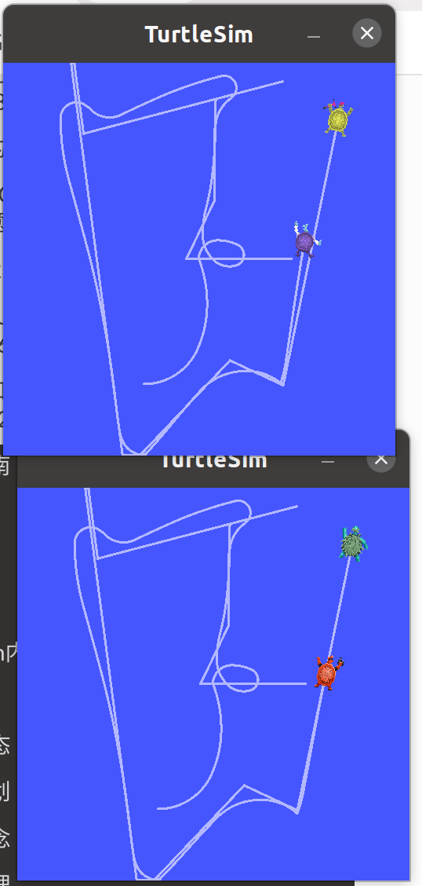

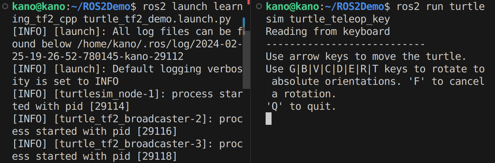

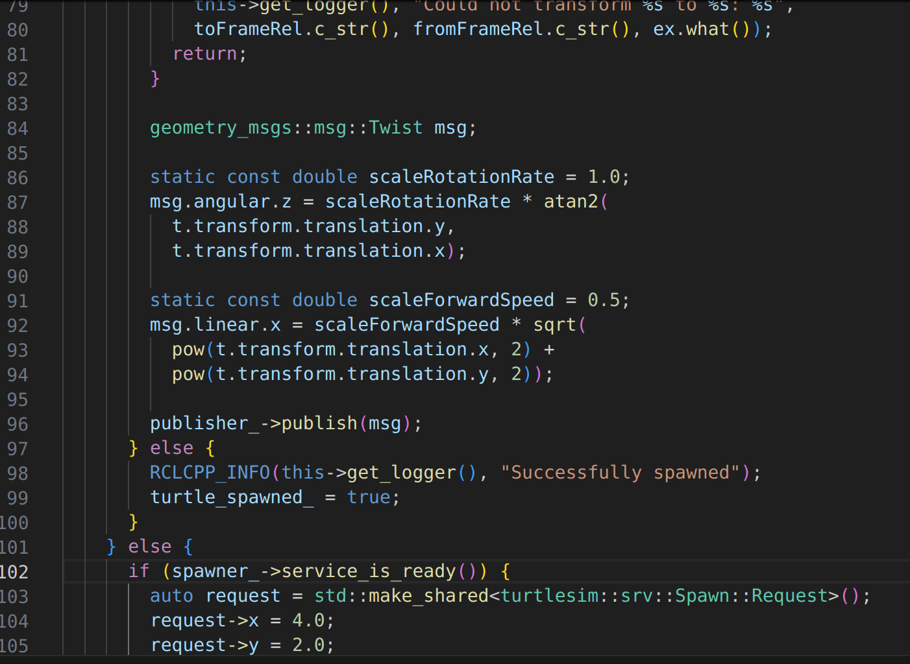

* **遇到的问题：**暂无

* **下周计划：**

1. 继续学习ROS2 使用tf2访问帧变换  四元数的使用 ROS launch
2. 继续学习C++

## 2024.3.2

* **本周完成：**

1. 学习了C++的内存分区模型、引用和面向对象编程的封装、对象初始化和清理。

2. 基于OOP 重新实现了ROS2的话题和服务通信

   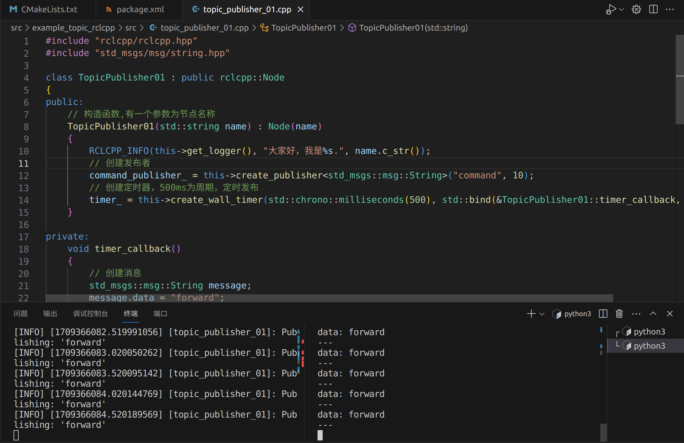

   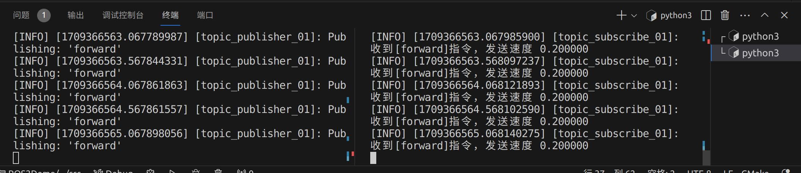

   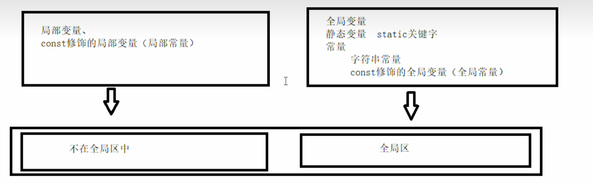

   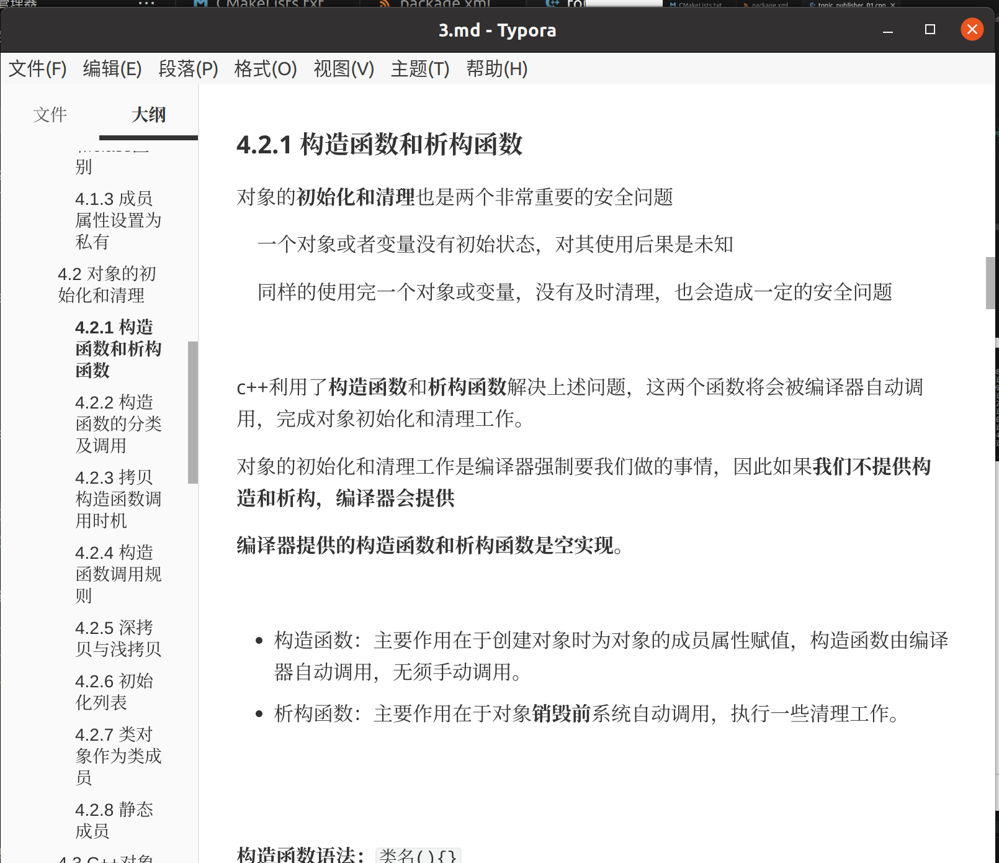

* **遇到的问题：**暂无

* **下周计划：**

1. 继续学习C++ 面向对象编程
2. 继续学习ROS2

## 2024.3.9

* **本周完成：**

1. 学习了C++对象模型和this指针，友元，运算符重载和继承
2. 修改自瞄代码

根据模式位修改frame_id的值

* **遇到的问题：**暂无

* **下周计划：**

1. 完成C++类和对象学习
2. 读大符代码

给大符代码加上根据模式位停止或继续接收图像

3. 继续学ROS2